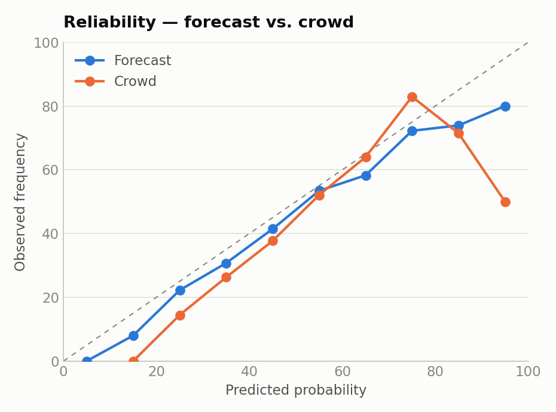
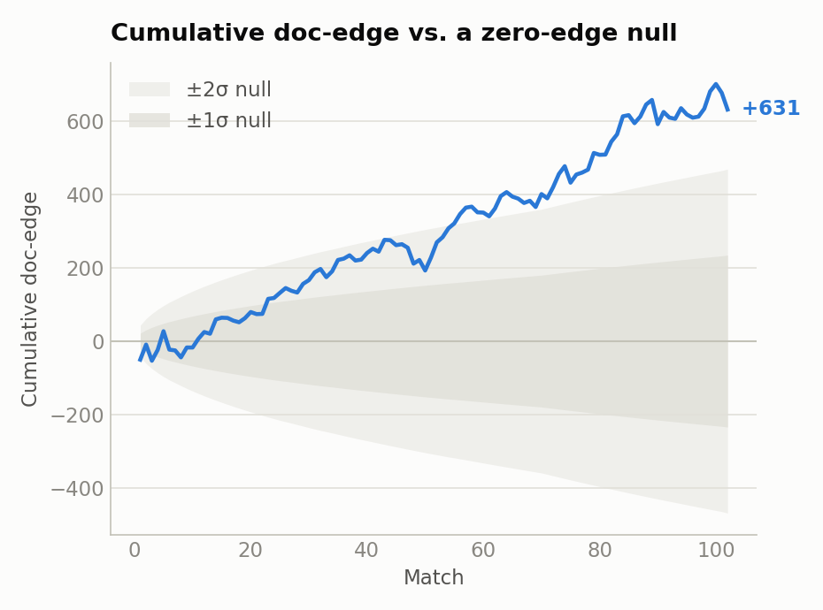
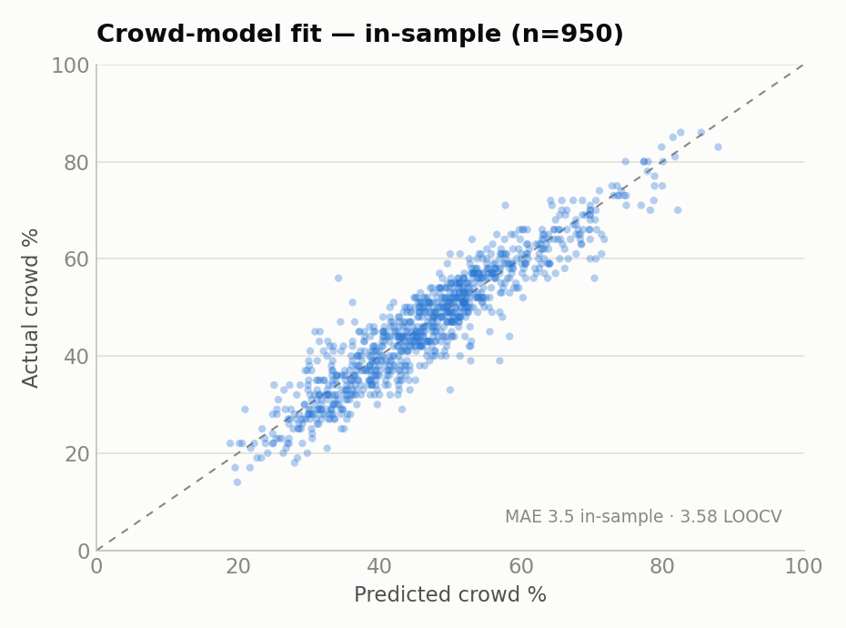
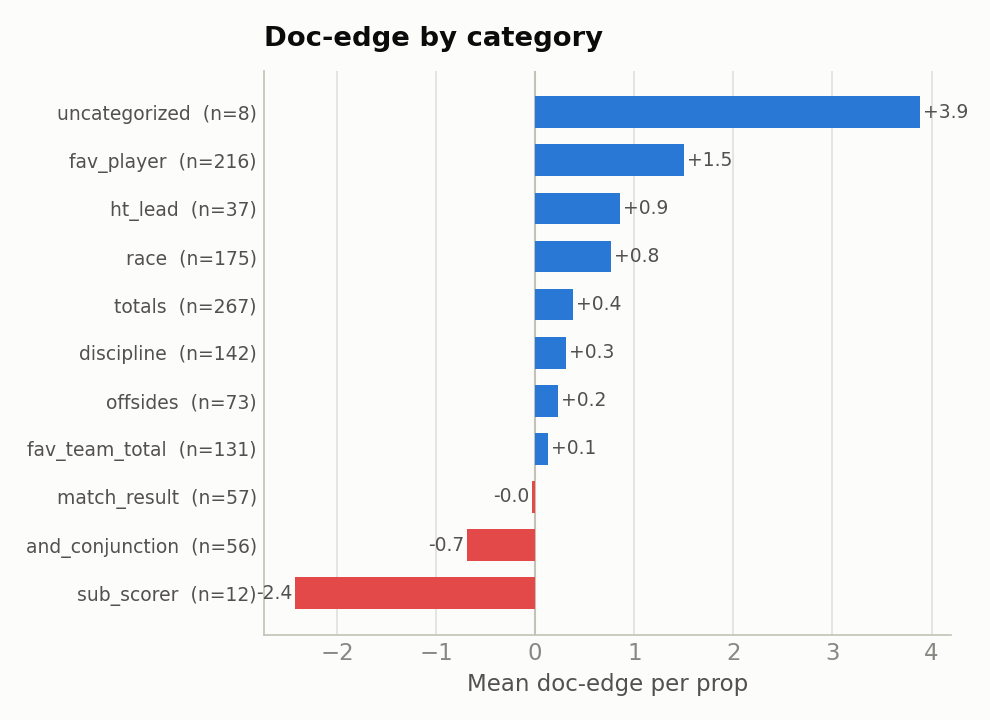

# Jump Trading Probability Cup 2026

### Author: Shridhar Mehendale

Forecasting system for **Jump Trading's Probability Cup**, a competition run over the
2026 FIFA World Cup (June 11 – July 19). Entrants submit probability forecasts (integers 1–99) for
~10–20 markets per match — outcomes, goals, cards, corners, shots, player props — locking at
kickoff. Scored by Relative Brier Points (RBP) against the crowd consensus of ~4,000 entrants.
Stage weighting: group 1× / knockout 2× / final 3×.

**Final: 8th globally, 3rd in the U.S. (4,000+ entrants).**


| | |
|---|---:|
| Matches forecast | 102 |
| Settled props | 1,174 |
| Doc-edge vs. consensus | +631.4 (+0.538/prop) |
| Doc-edge significance | t ≈ 2.69 |
| Platform RBP | 5,078.36 (+4.35/prop) |
| Beat consensus | 876 / 1,174 (74.6%) |
| Mean Brier | 0.215 (crowd 0.220) |

## Repository contents

| File | Description |
|---|---|
| `proppricer.py` | Poisson / Negative-Binomial pricing library — de-vig, scoreline grid, races, timing windows, player props. |
| `crowdmodel.py` | Empirical-Bayes model predicting the crowd consensus from your number + prop category. |
| `analyze.py` | Calibration diagnostics and edge attribution over `predictions.csv` (reliability, Brier decomposition, doc-edge + t-stat). |
| `calibrate_curve.py` | Historical base-rate pipeline (StatsBomb 2018–22 + ESPN 2026) → event-timing curves and rare-event rates. |
| `test_proppricer.py` | Unit tests for the pricing library. |
| `predictions.csv` | Every settled forecast — you / crowd / outcome / RBP. Source of truth for all results. |
| `results_log.md` | Per-match dashboard: platform / doc / beat-rate + top prop. |
| `lambda_reference.md` | λ priors, base rates, sub-type shares, style multipliers, settlement rules. |
| `categories.md` | The crowd-bias taxonomy that drives the crowd model. |
| `calibration_output.md` | Event-timing calibration output (3-way: prior / 2018–22 / 2026). |
| `requirements.txt` | Python dependencies. |

## Scoring

- Each forecast scored by **Brier** = (p − outcome)² — quadratic in distance from the result.
- **RBP** (Relative Brier Points) = (crowd Brier − your Brier) × 100 × stage_weight. Closer than the crowd → gain points; worse → lose points; magnitude grows with squared distance.
- **Example:** forecast 70%, crowd 65%, event happens → your Brier (0.30)² = 0.09, crowd Brier (0.35)² = 0.1225 → **+3.25** (× 1 group / 2 knockout / 3 final).
- **Two references used throughout:**
  - **doc-edge** — scored vs. the crowd's single consensus number (the documented formula). Skill vs. the line, cushion removed.
  - **platform RBP** — scored vs. the mean of individual entrants' Briers. Higher by a Jensen "cushion" that everyone near consensus collects for free. `platform RBP = doc-edge + cushion`.
- **Caveat:** per-match platform point totals may not perfectly reconcile — the platform adjusted the cushion during the tournament.

## Modeling Edge

- Forecasts are anchored to **de-vigged sharp lines** (DraftKings, FanDuel, Kalshi). Removing the vig from an efficient market recovers ≈ the true probability — the book cannot be out-modeled, and this system does not try to.
- The edge is against **the crowd of competitors, not the book.** It comes from three sources:

  1. **Crowd biases** — the crowd systematically:
     - overrates famous players and heavy favorites;
     - under-prices draws and absolute volume (corners, shots, cards totals);
     - compresses extreme-truth props toward ~50 (where the real edge lives);
     - fails to halve a full-match number for a half-scoped prop.
  2. **Lineup / minutes information** — player props priced only after confirmed XIs; benched and rotation-risk names faded below the crowd's name-anchor.
  3. **No added error** — honest, de-vigged, calibrated numbers; a proper scoring rule rewards exactly this.

- Edge concentrates where the truth is far from 50. Near-50 props are coin-flips the crowd also prices correctly — little edge there; conviction is spent on extreme-truth props.

## Pricing workflow for individual props

1. **Grab the market.** Pull the 3-way moneyline plus any direct lines (team totals, O/U goals ladder, team SOT/corners, player scorer/SOT, Kalshi prints).
2. **De-vig.** Proportional and power-method de-vig → fair probabilities (`proppricer.devig`, `devig_power`, `fair_one_sided`). One-sided player markets use a market-type vig table (~15% scorer vs ~7% team-count), not a flat shade.
3. **Derive team λ.** Invert the de-vigged moneyline into team scoring rates (`fit_lams_to_market`) — favorite/underdog split from the win/draw probs — and cross-check against the total-goals O/U.
4. **Build the prop from λ:**
   - totals / BTTS / scorelines → **bivariate scoreline grid** with Dixon-Coles ρ (`grid`, `market_pack`);
   - goal sub-types / timing windows → **thinning** `P(≥1) = 1 − e^(−share·λ)` off the event-share curve (`p_share_of_goals`, `window_share`);
   - "more X than opponent" → **two independent Poissons with tie handling** (`race`, `count_race`);
   - player props → share-of-team-λ × minutes factor (`player_score_prob`), Poisson-binomial for "N+ distinct players."
5. **Apply the anchor hierarchy.** A direct/real-money line for the prop overrides the model: **Kalshi (real-money %) > de-vigged book consensus > internal model.** Divergences are flagged, not averaged.
6. **Compare to the crowd** (`crowdmodel.py`) → submit where the model beats the predicted consensus (see Crowd model).

**Example (final, Spain v Argentina):** ML Spain +125 / Draw +200 / Arg +260 → de-vig 42 / 32 / 26 → λ ≈ Spain 1.35, Argentina 1.02 (cross-checked vs. the ~2.45 goals ladder). Team-half λ grid → "either team scores 2+ in a half" = 41%; BTTS taken from the Kalshi print (55) over the grid per the anchor hierarchy.

## The models

### Historical Analysis

Derives the base rates and event-timing priors used as the **prior tier** of pricing (below the market — always overridden by a market read when one exists).

- **`calibrate_curve.py`** — pipeline. Pulls **StatsBomb (2018–22, per-second event JSON)** and **ESPN (2026, keyEvents)**, computes event-timing share curves F(t) and rare-event / flat base rates. **Re-run through the tournament**, so 2026 data was incorporated live (e.g., card and goal timing blended toward the 2026 signal as matches accumulated).
- **`calibration_output.md`** — output: event-timing curves. 1st-half share F(45) and quarter nodes F(23)/F(68) for goals, shots, SOT, corners, cards, penalties, offsides, fouls — as a 3-way comparison (domain prior / 2018–22 / 2026).
- **`lambda_reference.md`** — output: consolidated λ priors. Per-90 base rates (goals ~2.5–2.7, yellows ~3.3–4.2, corners ~8.5–9.5, etc.), goal sub-type shares (headed, outside-box, own goal), match-event flat rates (subs, sub-scores), time-of-match shares, player building blocks, style multipliers, and settlement rules.

### Live models — `proppricer.py`

The pricing engine invoked per match; implements the workflow above. Core capabilities:

- **De-vig** — proportional + power-method; market-type vig table for one-sided props.
- **Distributions** — Poisson and Negative-Binomial (overdispersion for cards / corners / shots).
- **Scorelines** — bivariate grid with Dixon-Coles ρ → outcomes, totals, BTTS, conjunctions.
- **Market inversion** — fit team λ from the 3-way moneyline (`fit_lams_to_market`).
- **Races** — independent Poissons with explicit tie probability.
- **Timing** — hazard-curve windows (hydration-break and interval props), fed by the calibrated F(t) curves.
- **Extra time / advancement** — ET intensity scaling, shootout splits, `ever_leads`.
- **Player props** — share-of-team-λ × minutes factor; Poisson-binomial for distinct-player counts.
- **Submission helpers** — expected-RBP, Brier, clamp to integer [1, 99].

### Crowd model — `crowdmodel.py`

The score is relative to the crowd, so the crowd is modeled too. Predicts the competitors' consensus from your own estimate and the prop's category — the taxonomy of crowd-bias buckets (`fav_player`, `discipline`, `totals`, `race`, `offsides`, …) is defined in `categories.md`, each mapping to a distinct crowd bias.

- **Form** — per-category OLS of the crowd's number on yours, centered at 50: `crowd ≈ A_c + B_c · (you − 50)`. B_c < 1 captures the crowd compressing toward the mid-50s.
- **Prior** — the same line fit over *all* props pooled, `(A0, B0)` — empirical, "the average category." Unseen categories use it directly.
- **Shrinkage** — each category blends its own fit toward the prior: `A_c = w·A_own + (1−w)·A0` (same for B), with `w = n / (n + k)`, k = 10. Data-rich categories trust themselves; thin ones lean on the prior. (Empirical-Bayes / partial pooling; k is set and CV-validated, not grid-tuned.)
- **Accuracy** — leave-one-match-out CV MAE **3.58** (per-category model) vs. **3.98** for a single pooled line and **5.47** for the naive "crowd = your number" baseline (~35% lower).
- **Use** — flags props where the model sits on the wrong side of the predicted consensus (negative expected edge) before submission, converting the pricing model into a relative-value signal.

### Calibration & results — `analyze.py`

Computes cumulative edge and calibration diagnostics over `predictions.csv`.

- **Reliability** — observed frequency vs. forecast probability (quantile + fixed bins, Wilson intervals); ECE.
- **Brier decomposition** — reliability / resolution / uncertainty.
- **Recalibration** — Platt scaling to detect and correct over/under-confidence.
- **Edge attribution** — doc-edge and platform RBP by category, direction (above/below crowd), and half-scope.
- **Headline** — doc-edge +631.4 (+0.538/prop), **t ≈ 2.69** over 1,174 forecasts; beat consensus 74.6%.

<!-- charts generated by scripts/main_charts.py from predictions.csv -->

| | |
|---|---|
|  |  |
|  |  |

## Risk management

- **Correlated exposure.** Most props on a card load on a few shared game-scripts (e.g., "open vs. cagey game"). A set of independently-fair fades can collapse into one leveraged bet on a single script — the worst card of the tournament (−66 doc) was ~six low-event fades that all resolved on the same open-game outcome.
  - Fix: map each prop to the game-script it needs and cap **aggregate exposure to any single script**, not the individual bet sizes. Big earned fades stay — they are the best bucket (see edge-by-category); the leak is correlation, not size.
- **Objective-driven sizing.** Sizing follows the stakes, not blanket EV-max:
  - group stage (1×) → price each prop to its edge;
  - knockout (2×) → same edge-pricing, but tighter correlation/script caps since a correlated bad card now costs double, and research concentrated here where points count more;
  - the final (3×, prize on the line) → reframed to maximize **P(finishing in the money)** given the leaderboard: deviation caps, a pre-lock worst-case script budget (worst script ≥ −60), no max-stake single props.
- **Tail-loss caps.** Per-prop deviation limits plus a pre-lock scenario table (grind / normal / tail scripts) bound the worst-case card before submission. Counterfactual check on the realized final: the risk-managed card (+205.8) scored within ~4 points of the pure max-EV card (+209.4) and beat the rank-chasing card (+186.3) — the defensive posture cost almost nothing while capping the tail.

## Reproduce

```bash
pip install -r requirements.txt

python3 analyze.py            # cumulative edge, calibration, per-category attribution
python3 crowdmodel.py fit     # crowd-model fit + leave-one-match-out CV
python3 scripts/main_charts.py  # regenerate the charts in images/
python3 test_proppricer.py    # pricing-library tests
```

Only dependency is `matplotlib` (charts); everything else is the Python standard library.